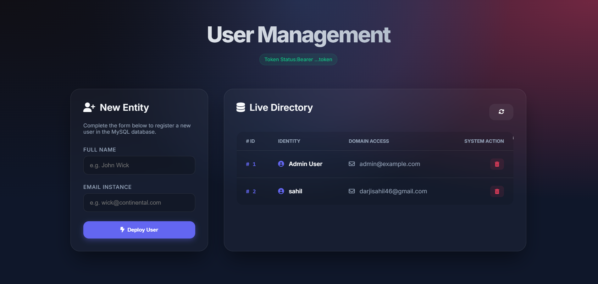
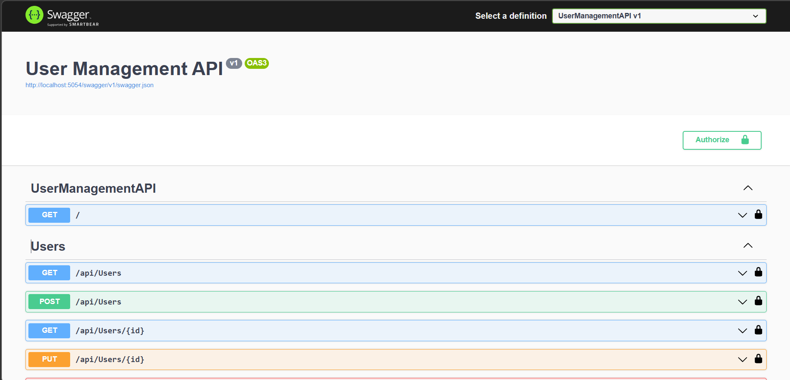

# 🚀 User Management Pro: Full-Stack ASP.NET Core & MySQL

A premium, glassmorphic User Management application built with **ASP.NET Core 9 Web API** and a modern, "cool" frontend. Features real-time CRUD operations, custom middleware, and persistent storage via **XAMPP MySQL**.

---

## ✨ Features

- **🛡️ Custom Middleware Architecture**:
  - **Authentication**: Secure endpoints with a Bearer Token (`mysecrettoken`).
  - **Logging**: Real-time console tracking of every HTTP request and response.
  - **Error Handling**: Global exception catching with clean JSON error responses.
- **✨ Ultra-Modern Frontend**:
  - Glassmorphism design with `backdrop-filter` blur effects.
  - Mesh radial gradient background.
  - Fully responsive layout (Mobile, Tablet, Desktop).
  - Modern animations and Row-hover interactions.
- **💾 Persistent Storage**: Full integration with **MySQL (XAMPP)** using **Entity Framework Core**.
- **🛠️ API Documentation**: Integrated **Swagger UI** for testing endpoints.
- **⚡ Reactive UI**: Built with Vanilla JS and CSS for maximum performance and "no-framework" simplicity.

---

## 🛠️ Tech Stack

- **Backend**: ASP.NET Core 9 Web API
- **ORM**: Entity Framework Core with Pomelo MySQL
- **Database**: MySQL (via XAMPP)
- **Frontend**: HTML5, CSS3 (Modern Grid/Flexbox), Vanilla JavaScript
- **Icons**: Font Awesome 6
- **Typography**: Inter (Google Fonts)

---
## 📸 Screenshots

### 🖥️ Dashboard UI


### 🧪 API Swagger Interface


## 🚀 Getting Started

### 1. Database Setup (XAMPP)
1. Open **XAMPP Control Panel** and start **Apache** and **MySQL**.
2. Open **phpMyAdmin** (`http://localhost/phpmyadmin`).
3. Import the `setup_database.sql` file provided in the repository root. This will create the `UserManagementDB` and the `Users` table automatically.

### 2. Run the Application
1. Clone this repository and navigate to the project folder:
   ```powershell
   cd UserManagementAPI
   ```
2. Build and run the project:
   ```powershell
   dotnet run
   ```
3. The server will start (usually on `http://localhost:5054` or `5000`).

### 3. Usage
- **Frontend**: Visit the root URL (e.g., `http://localhost:5054/`) in your browser to see the dashboard.
- **API Swagger**: Visit `http://localhost:5054/swagger` to explore the API documentation.
- **Authentication**: Use the token `mysecrettoken` in the Authorization header.

---

## 📁 Project Structure

- `Controllers/`: API CRUD endpoints.
- `Data/`: Entity Framework DbContext.
- `Middleware/`: Custom pipeline logic (Auth, Logging, Error).
- `Models/`: User data models with DataAnnotations validation.
- `wwwroot/`: Premium Frontend (HTML, CSS, JS).
- `setup_database.sql`: MySQL initialization script.

---

## 🛡️ License

This project is open-source and available under the **MIT License**.

---

*Built with ❤️ by a developer who loves cool designs!*
